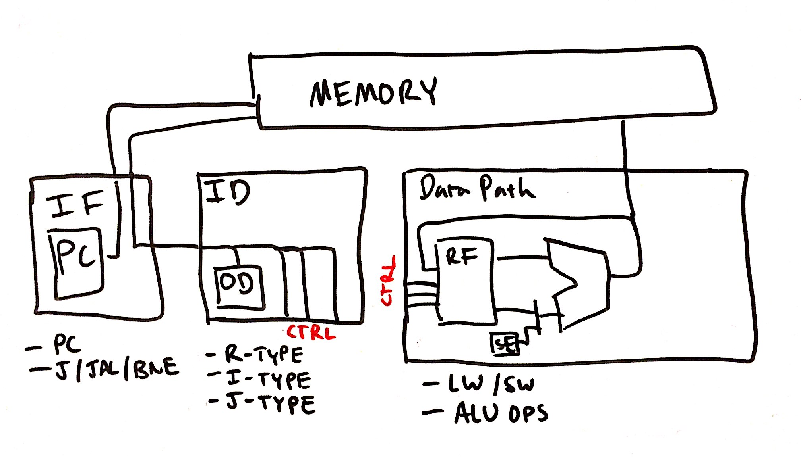
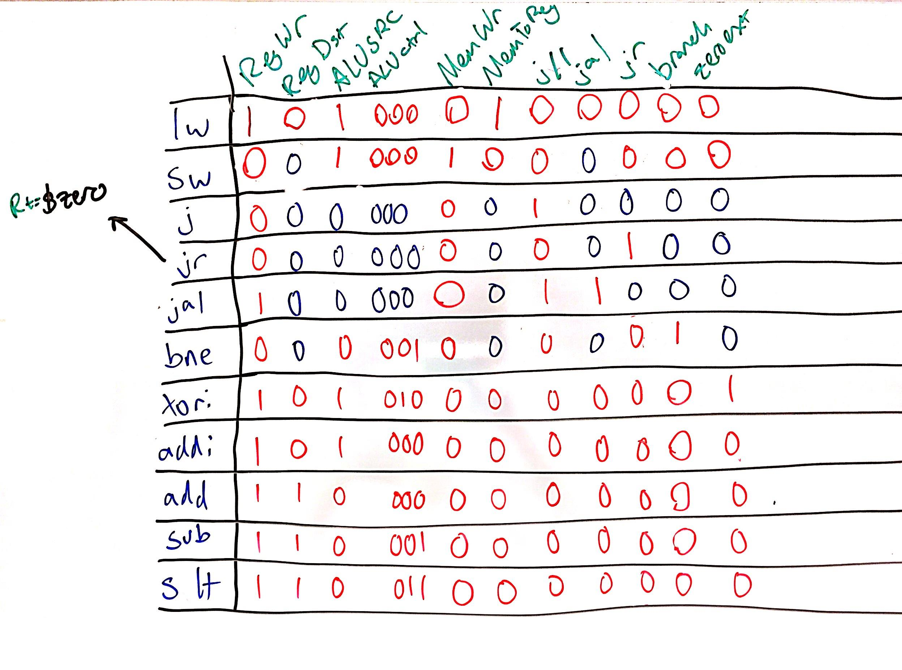
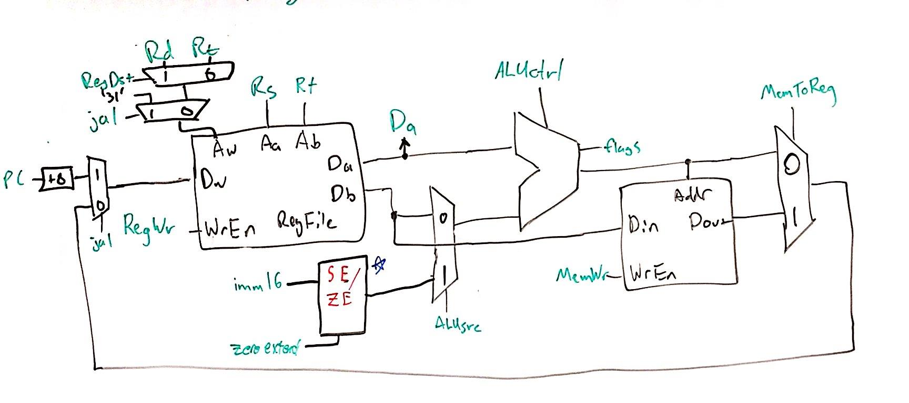
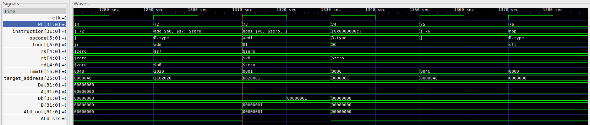

# Lab 3 Writeup
### William Derksen, Alexander Hoppe, Sam Myers, Taylor Sheneman

## Processor Architecture

In this lab we designed a Single Cycle CPU complete with an Instruction Fetch Unit, Instruction Decoder, Arithmetic Logic Unit and associated logic, Memory Access, and Writeback to Registers.  We based the design off of our previous in-class designs, with a couple important changes in order to accommodate different instructions.

Broadly, our architecture uses the value from the Program Counter to fetch instructions from the first segment of memory (from address 0 - 8192). We then decode this instruction into each of the major components of the I- J- and R-type encodings, as well as into an array of control signals depending on the opcode. These signals and controls affect the Program counter in the instruction fetch unit (in order to branch and jump), the ALU (to execute mathematical operations), the Memory (to load and store), and the Register File (for determining I J and R type instructions).

Our processor architecture supports a subset of the MIPS ISA, consisting of `LW`, `SW`, `J`, `JR`, `JAL`, `BNE`, `XORI`, `ADDI`, `ADD`, `SUB`, and `SLT`.

Changelog:

In order to correctly to do the new instruction `xori`, we needed to create a more versatile Sign Extend component that could also Zero Extend if needed. We came up with a simple design with a Sign Extend control signal that allowed for both of these processes without needing a bitwise multiplexer. We did this by setting the seventeenth value of the input to the `and` of the control signal and the sixteenth value of the input.  Then we sign extend naturally from the 17th value.

Additionally, for jump and link we added two new muxes, one for choosing register `$31` in order to do `jal`, and one right before the writeback to the `Dw` port for the regfile.  This sets the PC to the value that is to be written to register `$31`.  For `jal`, the jump part is the same as a normal jump instruction.

When first trying to run code on our CPU, we changed our architecture from a Harvard architecture with separate memory for instructions and data to Von Neumann architecture with one contiguous memory to be more compatible with the Mars assembler's output for MIPS.

While running basic tests for the first time, we were confronted with issues loading and storing data to memory. For some reason we were only executing odd-numbered instructions for a while, which was very problematic. We also were having loads and stores executing out of order.

Eventually we traced this back to memory and writeback instructions being triggered `@ (posedge clk)` which was preventing instructions from being fetched properly and also preventing loads and stores from executing except for every other cycle. We solved this by establishing the single-cycle timing scheme below and enforcing it, moving memory write and writeback operations to the negative clock edge.

This diagram has the program counter updating on the positive edge, then instructions being read from memory combinationally, decoded combinationally, ALU result being computed combinationally, and then the memory or writeback happening on negative edge. In a real single-cycle CPU we'd have to worry about timing for all of these, but for our model the combinational steps are instantaneous so this is not an issue.

### Block Diagram

Our single-cycle CPU is divided up into two main modules, with one shared memory between all of them. This design arose because we originally implemented a Harvard architecture, but then pivoted to Von Neumann later down the line.

#### Instruction Fetch
Inside our instruction-fetch module we keep track of the program counter and any jump or branch signals that need to modify the PC input to instruction memory or set it to a different value.

Below is the table of all of the control signals for our CPU and all of the different states they are in. In this diagram, control signals that do not matter for a particular instruction are drawn in blue, and those that are important are in red.

#### Data Path

Below is the data path module, which can operate on two registers or an immediate and write its arithmetic result to memory or a register, or store the program counter (plus two instructions) in the case of a `jal`. We did make a custom module to do sign-extending or logical-extending for `xori`, since the difference is just what we extend with, zeros or the MSB.

### RTL Examples

## Test Plan
We implemented various assembly-based tests to test our CPU and also to push our assembly programming skills. For the very basic first functionality test, we implemented `asm/add.asm` which is just a series of adds. We also implemented a complete test of our instruction set in `asm/basic_testbench.asm`, and finally we implemented the quicksort algorithm in assembly, which can be found in `asm/quicksort.asm`.

#### add.asm
The add test was just a series of `addi` instructions to the same `$t0` register to allow us to debug our ability to load memory into our CPU and test the instruction fetch order. It actually allowed us to debug our instruction fetch bug in which instructions were taking two cycles to execute. It turned out that the instruction output of our memory was only updating `@ (address)` which was the data memory address port, so the instruction memory wasn't being output until the writeback state of a previous instruction.

#### Quicksort

#### Assembly Test Bench
The assembly test bench was a program designed to test all of the different functions in our ISA. It has explicit test subroutines for `lw` and `sw`, `bne`, `xori`, `addi`, `add`, `sub`, and `slt`. We chose to omit tests for `j`, `jr`, and `jal` because the rest of the testbench used them so heavily that it would never complete successfully if they were not correct. Each subroutine sets a return value in a top level register, `$s7`, which is checked before executing additional subroutines. If `$s7` is set to 1, a test has failed and the program exits (falls into a jump trap loop). If at the end of the program, the `$s7` register is zero, then the testbench succeeded. The testbench ends with a MARS syscall which displays the return value in `$s7`, which successfully returned zero when run on the MARS MIPS emulator.

This testbench is what is run by using the `./test.sh` script in the top level directory of the project.

This testbench allowed us to debug our memory load and store issue having to do with the read-execute-write cycle happening all at the same clock cycle. Once we resolved this issue, we were met with the following result:

As is visible here, the `$s7` register was still `0x00000000` at the time of program end. This can be seen as the `Da` bus (combinational output of the regfile) is all zeros during instruction 73 when the input address `rs` is `$s7`. This means the test bench succeeded.

## Performance/Area Design analysis

## Work Plan Reflection
