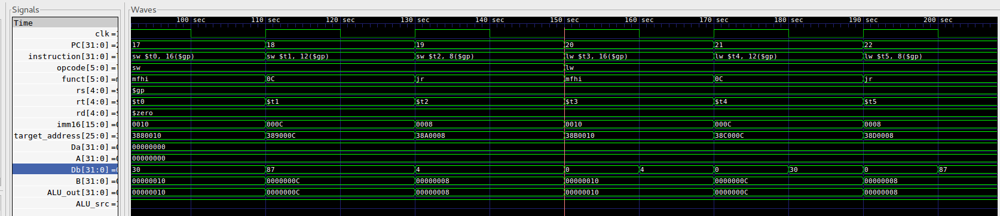
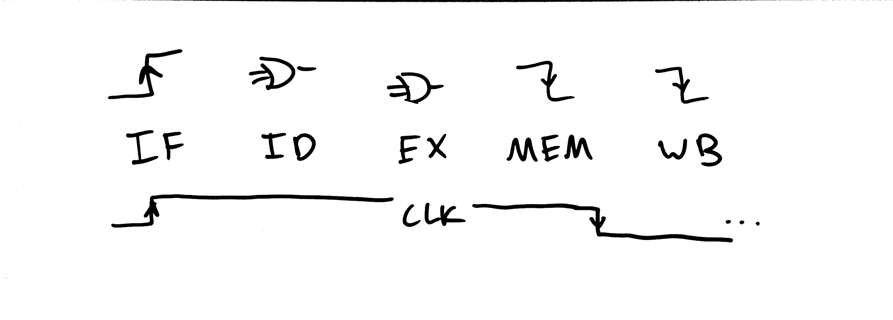

# Lab 3 Writeup
### William Derksen, Alexander Hoppe, Sam Myers, Taylor Sheneman

## Processor Architecture

In this lab we designed a Single Cycle CPU complete with an Instruction Fetch Unit, Instruction Decoder, Arithmetic Logic Unit and associated logic, Memory Access, and Writeback to Registers.  We based the design off of our previous in-class designs, with a couple important changes in order to accommodate different instructions.

Broadly, our architecture uses the value from the Program Counter to fetch instructions from the first segment of memory (from address 0 - 8192). We then decode this instruction into each of the major components of the I- J- and R-type encodings, as well as into an array of control signals depending on the opcode. These signals and controls affect the Program counter in the instruction fetch unit (in order to branch and jump), the ALU (to execute mathematical operations), the Memory (to load and store), and the Register File (for determining I J and R type instructions).

Our processor architecture supports a subset of the MIPS ISA, consisting of `LW`, `SW`, `J`, `JR`, `JAL`, `BNE`, `XORI`, `ADDI`, `ADD`, `SUB`, and `SLT`.

Changelog:

In order to correctly to do the new instruction `xori`, we needed to create a more versatile Sign Extend component that could also Zero Extend if needed. We came up with a simple design with a Sign Extend control signal that allowed for both of these processes without needing a bitwise multiplexer. We did this by setting the seventeenth value of the input to the `and` of the control signal and the sixteenth value of the input.  Then we sign extend naturally from the 17th value.

Additionally, for jump and link we added two new muxes, one for choosing register `$31` in order to do `jal`, and one right before the writeback to the `Dw` port for the regfile.  This sets the PC to the value that is to be written to register `$31`.  For `jal`, the jump part is the same as a normal jump instruction.

While running basic tests for the first time, we were confronted with issues loading and storing data to memory. For some reason we were only executing odd-numbered instructions for a while, which was very problematic. We also were having loads and stores executing out of order.

Eventually we traced this back to memory and writeback instructions being triggered `@ (posedge clk)` which was preventing instructions from being fetched properly and also preventing loads and stores from executing except for every other cycle. We solved this by establishing the single-cycle timing scheme below and enforcing it, moving memory write and writeback operations to the negative clock edge.

This diagram has the program counter updating on the positive edge, then instructions being read from memory combinationally, decoded combinationally, ALU result being computed combinationally, and then the memory or writeback happening on negative edge. In a real single-cycle CPU we'd have to worry about timing for all of these, but for our model the combinational steps are instantaneous so this is not an issue.

### Block Diagram

### RTL Examples

## Test Plan

### Results

## Performance/Area Design analysis

## Work Plan Reflection
