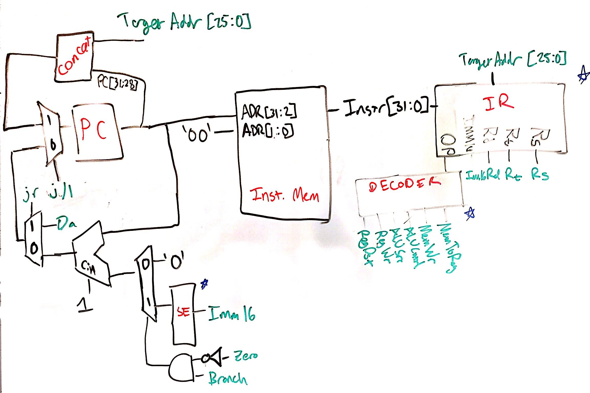

# Lab 3 Writeup
### William Derksen, Alexander Hoppe, Sam Myers, Taylor Sheneman

## Processor Architecture

In this lab we designed a Single Cycle CPU complete with an Instruction Fetch Unit, Instruction Decoder, Arithmetic Logic Unit and associated logic, Memory Access, and Writeback to Registers.  We based the design off of our previous in-class designs, with a couple important changes in order to accommodate different instructions.

Broadly, our architecture uses the value from the Program Counter to fetch instructions from the first segment of memory (from address 0 - 8192). We then decode this instruction into each of the major components of the I- J- and R-type encodings, as well as into an array of control signals depending on the opcode. These signals and controls affect the Program counter in the instruction fetch unit (in order to branch and jump), the ALU (to execute mathematical operations), the Memory (to load and store), and the Register File (for determining I J and R type instructions).

Our processor architecture supports a subset of the MIPS ISA, consisting of `LW`, `SW`, `J`, `JR`, `JAL`, `BNE`, `XORI`, `ADDI`, `ADD`, `SUB`, and `SLT`.

Changelog:

In order to correctly to do the new instruction `xori`, we needed to create a more versatile Sign Extend component that could also Zero Extend if needed. We came up with a simple design with a Sign Extend control signal that allowed for both of these processes without needing a bitwise multiplexer. We did this by setting the seventeenth value of the input to the `and` of the control signal and the sixteenth value of the input.  Then we sign extend naturally from the 17th value.

Additionally, for jump and link we added two new muxes, one for choosing register `$31` in order to do `jal`, and one right before the writeback to the `Dw` port for the regfile.  This sets the PC to the value that is to be written to register `$31`.  For `jal`, the jump part is the same as a normal jump instruction.

When first trying to run code on our CPU, we changed our architecture from a Harvard architecture with separate memory for instructions and data to Von Neumann architecture with one contiguous memory to be more compatible with the Mars assembler's output for MIPS. We also changed our program counter to increment by 1, and our `jal` instruction to store `PC + 2` because our memory is word-addressed by 32-bit word as opposed to byte-addressing.

While running basic tests for the first time, we were confronted with issues loading and storing data to memory. For some reason we were only executing odd-numbered instructions for a while, which was very problematic. We also were having loads and stores executing out of order.

Eventually we traced this back to memory and writeback instructions being triggered `@ (posedge clk)` which was preventing instructions from being fetched properly and also preventing loads and stores from executing except for every other cycle. We solved this by establishing the single-cycle timing scheme below and enforcing it, moving memory write and writeback operations to the negative clock edge.

This diagram has the program counter updating on the positive edge, then instructions being read from memory combinationally, decoded combinationally, ALU result being computed combinationally, and then the memory or writeback happening on negative edge. In a real single-cycle CPU we'd have to worry about timing for all of these, but for our model the combinational steps are instantaneous so this is not an issue.

### Block Diagram

Our single-cycle CPU is divided up into two main modules, with one shared memory between all of them. This design arose because we originally implemented a Harvard architecture, but then pivoted to Von Neumann later down the line.

#### Instruction Fetch
Inside our instruction-fetch module we keep track of the program counter and any jump or branch signals that need to modify the PC input to instruction memory or set it to a different value.

Below is the table of all of the control signals for our CPU and all of the different states they are in. In this diagram, control signals that do not matter for a particular instruction are drawn in blue, and those that are important are in red.

#### Data Path

Below is the data path module, which can operate on two registers or an immediate and write its arithmetic result to memory or a register, or store the program counter (plus two instructions) in the case of a `jal`. We did make a custom module to do sign-extending or logical-extending for `xori`, since the difference is just what we extend with, zeros or the MSB.

### RTL Example

To more clearly illustrate the path of an instruction through our CPU, the following is a walkthrough of a single cycle of program execution using the `addi` instruction:

`Reg[rt] = Reg[rs] + SignExtend(Imm16)`

#### IF

The first stage is instruction fetch, kicked off by the positive edge of our clock incrementing the program counter. The program counter input is already fed a combinational `PC + 1` (since our memory is 32 bit word-addressed) so the PC is simply a positive-edge-triggered D-flipflop. After incrementing, the PC is fed into the instruction address port of our memory, which combinationally returns the next instruction on the associated data port.

#### ID / EX

Once the instruction is read from memory, it is then fed through our instruction decode unit. This unit combinationally sets the register addresses `rs` and `rt` and also the `imm16` as well as decoding the opcode of the instruction into the proper control signals seen in the previous section.

Next is the execute section, which also executes combinationally. The output of the regfile `Da` is fed into the ALU, and the other input is muxed to the output of our sign-extend module, which sign-extends `imm16`. The ALU result is then displayed combinationally. Since there are no delays in our ideal system, this all happens instantaneously after the positive clock edge.

#### MEM / WB

After the ID and EX phases have finished, the memory and writeback phases (MEM and WB) execute on the negative edge of the clock. On the negative clock edge the result of the ALU is clocked back into the `Dw` port of the regfile, which has been set to `rt` by the instruction decode module. The memory is not written to in this case, as `addi` is an I-type instruction so the memory write enable is disabled by the ID unit.

The clock cycle for all of this would have to be selected to be sufficiently long for the combinational logic of a memory read and then an ALU operation, plus a memory write on the negative part of the clock cycle.

## Test Plan
We implemented various assembly-based tests to test our CPU and also to push our assembly programming skills. For the very basic first functionality test, we implemented `asm/add.asm` which is just a series of adds. We also implemented a complete test of our instruction set in `asm/basic_testbench.asm`, and finally we implemented the quicksort algorithm in assembly, which can be found in `asm/quicksort.asm`.

#### add.asm
The add test was just a series of `addi` instructions to the same `$t0` register to allow us to debug our ability to load memory into our CPU and test the instruction fetch order. It actually allowed us to debug our instruction fetch bug in which instructions were taking two cycles to execute. It turned out that the instruction output of our memory was only updating `@ (address)` which was the data memory address port, so the instruction memory wasn't being output until the writeback state of a previous instruction.

#### Quicksort
In addition to a simpler test bench, we decided to target the implementation of a more challenging algorithm to really push our assembly skills, in this case the quicksort algorithm. This algorithm requires us to use all seven instructions in our reduced set.

We started by implementing the quicksort algorithm in C, which allowed us to get the control flow down in a language that we could pretty easily expand out into direct memory manipulations and register operations. From there we expanded it out into assembly, primarily the work of @Halliax Taylor Sheneman. Once it successfully executed in MARS, we loaded it into our CPU and were met with success! It was a difficult program to use to debug the CPU, but it provided a stress test to make sure our hardware worked in an actual implementation.

#### Assembly Test Bench
The assembly test bench was a program designed to test all of the different functions in our ISA. It has explicit test subroutines for `lw` and `sw`, `bne`, `xori`, `addi`, `add`, `sub`, and `slt`. We chose to omit tests for `j`, `jr`, and `jal` because the rest of the testbench used them so heavily that it would never complete successfully if they were not correct. Each subroutine sets a return value in a top level register, `$s7`, which is checked before executing additional subroutines. If `$s7` is set to 1, a test has failed and the program exits (falls into a jump trap loop). If at the end of the program, the `$s7` register is zero, then the testbench succeeded. The testbench ends with a MARS syscall which displays the return value in `$s7`, which successfully returned zero when run on the MARS MIPS emulator.

This testbench is what is run by using the `./test.sh` script in the top level directory of the project.

This testbench allowed us to debug our memory load and store issue having to do with the read-execute-write cycle happening all at the same clock cycle. Once we resolved this issue, we were met with the following result:

As is visible here, the `$s7` register was still `0x00000000` at the time of program end. This can be seen as the `Da` bus (combinational output of the regfile) is all zeros during instruction 73 when the input address `rs` is `$s7`. This means the test bench succeeded.

## Performance/Area Design analysis
Since our design is single-cycle and written behaviorally for code to be uploaded later, the Vivado synthesis of our program tends to optimize out pretty much all of the actual execution of instructions, since the memory is default initialized to zero. This is interpreted by the synthesizer as effectively having an empty program, hence it does not need any actual CPU.

Failing synthesizer performance and area analysis, there are a few performance and area heuristic analyses that can be applied. First, our project is fundamentally limited in throughput by nature of it only being able to execute one instruction at a time in a clock cycle equivalent to the entire length of execution. We can execute an instruction in the time it takes to load an instruction from memory, decode it, do an ALU computation, and then in the worst case write back to memory. This is quite slow, as usually memory access takes much longer than other computing operations.

We're also limited in area, as we cannot do any module reuse within the single-cycle CPU. For example, we have an additional ALU in our CPU for doing the adding to increment the `PC`, because we can't do reuse when our main program ALU is going to be required later in the same cycle. We were able to reuse our memory, however, because our read and write access happens at different times during the clock cycle. We could potentially have saved area by consolidating our read and write ports into one, since they're accessed at different times, but this would require more timing control signals than just having combinational outputs.

While a single-cycle design is limited in these ways, it's also much simpler to design than a much higher-throughput pipeline design. It's streamlined in that it can all be drawn out on one schematic without any need for mental juggling of timing. It was an MVP for this project, and it ended up being sufficiently challenging. 

## Work Plan Reflection
As is often the case, we underestimated how much work this lab would take us in the beginning. We had originally planned to rush to MVP with a single-cycle CPU and then branch out to complete a pipeline CPU if we had time. In the end, it took us the first week to plan out how everything would be implemented which was on schedule, but then the code implementation of our CPU took more time than just the weekend. Fortunately, at the same time we were able to develop our assembly test bench, so when we actually did finish implementation on Wednesday of the final week, we were able to flash code on it immediately.

The place we could've improved the process here was in allowing more time for debugging and parallelizing more. We were met with a couple of very difficult issues over the course of the last few days of the project, and with only Thursday and Friday to debug them, we were really under the gun. In fact, we only barely finished passing our test benches at around 11:59 on Friday (hence the report is quite late). We also could have parallelized our development process more. When we developed our test benches and implemented our verilog at the same time, we were much more productive than when we were single-threadedly debugging our program at the end of the week. The independent clock and memory access issues could have been resolved at the same time, and the report could have been written during that time as well.
